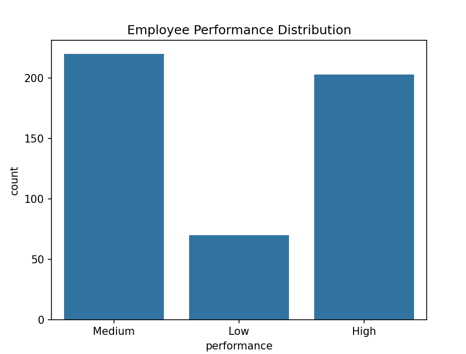
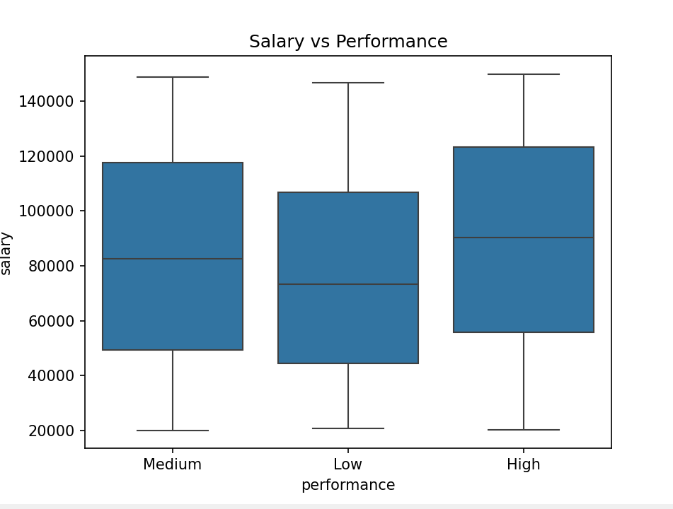
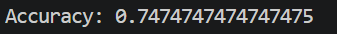

# 🚀 Employee Performance Predictor

---
## 📊 Overview
A Machine Learning project that predicts employee performance using data analytics.

Helps organizations identify high and low performers for better decision-making.

---
## 🎯 Problem Statement
Traditional performance evaluation is manual and biased.

This project automates prediction using employee data.

---

## 💼 Business Use Cases
- Identify high-performing employees
- Detect low performers early
- Support promotion decisions
- Plan training programs

---

## 🛠️ Tech Stack
Python
Pandas
NumPy
Matplotlib
Seaborn
Scikit-learn

---
## 🏗️ Workflow
Employee Data → Preprocessing → Feature Engineering → Model Training → Prediction → Insights

---
## 📂 Project Structure

```
Employee-Performance-Predictor/
├── data/
│   └── employee_data.csv
├── src/
│   ├── data_generator.py
│   ├── preprocessing.py
│   ├── model.py
├── models/
│   └── model.pkl
├── outputs/
├── images/
│   ├── dataset_preview.png
│   ├── performance_distribution.png
│   ├── salary_vs_performance.png
│   ├── model_accuracy.png
├── main.py
├── requirements.txt
└── README.md
```
---
## ⚙️ Installation
pip install pandas numpy matplotlib seaborn scikit-learn joblib


## ▶️ How to Run
python src/data_generator.py

python main.py

---


## 📊 Results

### Dataset Preview


### Performance Distribution


### Salary vs Performance


### Model Accuracy


---

## 🤖 Model Used
- Random Forest Classifier

---

## 📈 Output
The model predicts employee performance as:

- High
- Medium
- Low

--- 

## 🧠 Key Insights

- Higher training hours improve performance
- Salary positively impacts results
- Experience contributes to growth

---

## 🚀 Key Achievements

- Built ML model for employee performance prediction
- Achieved ~75% accuracy
- Created synthetic HR dataset
- Generated insights using data visualization

---
## 🚀 Future Improvements

- Use real HR dataset
- Build Streamlit dashboard
- Deploy as web app
- Add attrition prediction

---

## 👩‍💻 Author
Nidhi Apotikar

---

⭐ If you like this project
Give it a ⭐ on GitHub!
